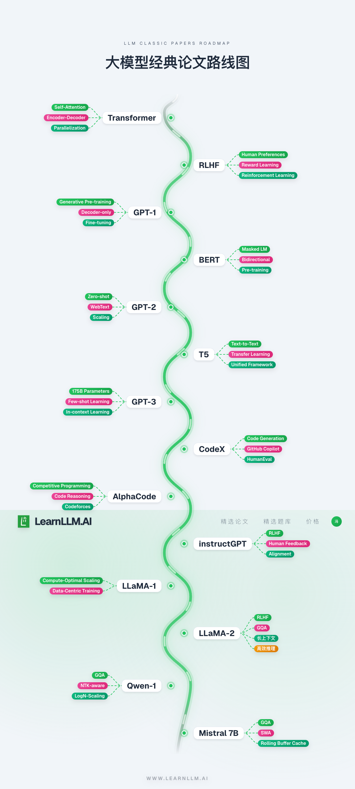

  
  &nbsp;
  
  &nbsp;
  
  &nbsp;
  

<strong>Learning LLM is all you need.</strong>

  <a href="README.md">中文</a> | English | <a href="README.ru.md">Русский</a>

<strong>👉 Visit <a href="https://learnllm.ai?ref=github">LearnLLM.AI</a> | Start learning large language models here</strong>

## LearnLLM.AI Highlights

 **Curated LLM interview question bank**: practical questions from fundamentals to frontier topics, built to help you prepare for job interviews and catch career opportunities.

 **Structured paper reading**: starting from the foundational 2017 Transformer paper, the course follows the evolution of the field with a clear knowledge structure, suitable for developers with different backgrounds who want to improve step by step.

**Exclusive promo code**

We have prepared a limited-time promo code for GitHub users: ***GITHUB50***. Hope to keep learning and growing together with you on [LearnLLM.AI](https://learnllm.ai?ref=github)!

**Companion video lessons, continuously updated**:

👉 Watch on [bilibili](https://space.bilibili.com/37863979/lists?sid=7144646)

👉 Watch on [YouTube](https://www.youtube.com/@learnllm-ai)

*If you have any questions, feel free to contact us at any time.*

*Happy Learning!*

*The LearnLLM.AI team*

---

## Selected LLM Papers

| Time | Paper | Introduction | Video | Start learning |
| --- | --- | --- | --- | --- |
| 2017-06-12 | [Transformer](https://arxiv.org/abs/1706.03762) | Introduced self-attention and the Transformer architecture |  |  |
| 2018-06-11 | [GPT-1](https://cdn.openai.com/research-covers/language-unsupervised/language_understanding_paper.pdf) | A generative Transformer with pre-training plus fine-tuning |  |  |
| 2018-10-11 | [BERT](https://arxiv.org/abs/1810.04805) | Bidirectional encoder: MLM plus NSP |  |  |
| 2019-02-14 | [GPT-2](https://cdn.openai.com/better-language-models/language_models_are_unsupervised_multitask_learners.pdf) | Large-scale unsupervised text generation |  |  |
| 2019-10-23 | [T5](https://arxiv.org/abs/1910.10683) | A unified text-to-text framework |  |  |
| 2020-05-28 | [GPT-3](https://arxiv.org/abs/2005.14165) | Large models and few-shot learning ability |  |  |
| 2020-10 | [ViT](https://arxiv.org/abs/2010.11929) | Brought the Transformer backbone into vision |  |  |
| 2021-02 | [ViLT](https://arxiv.org/abs/2102.03334) | A minimal vision-language pre-training architecture |  |  |
| 2021-02 | [CLIP](https://arxiv.org/abs/2103.00020) | Zero-shot visual learning through natural language supervision |  |  |
| 2021-02 | [DALL·E 1](https://arxiv.org/abs/2102.12092) | The beginning of autoregressive text-to-image generation |  |  |
| 2021-07-07 | [CodeX](https://arxiv.org/abs/2107.03374) | A GPT-family model for code generation |  |  |
| 2021-12 | [Stable Diffusion](https://arxiv.org/abs/2112.10752) | Latent diffusion models pushed open text-to-image generation forward |  |  |
| 2022-02-08 | [AlphaCode](https://arxiv.org/abs/2203.07814) | A competitive programming level code generation system |  |  |
| 2022-03-04 | [InstructGPT](https://arxiv.org/abs/2203.02155) | Human feedback alignment and instruction tuning |  |  |
| 2022-04 | [DALL·E 2](https://arxiv.org/abs/2204.06125) | High-fidelity text-to-image generation based on CLIP Latents |  |  |
| 2022-12 | [Whisper](https://arxiv.org/abs/2212.04356) | A foundation model for speech recognition with large-scale weak supervision |  |  |
| 2023-02-27 | [LLaMA-1](https://arxiv.org/pdf/2302.13971) | An efficient open pre-trained base model |  |  |
| 2023-04 | [LLaVA](https://arxiv.org/abs/2304.08485) | An important starting point for open multimodal instruction tuning |  |  |
| 2023-07-18 | [LLaMA-2](https://arxiv.org/abs/2307.09288) | An upgraded LLaMA release with commercial use allowed |    |  |
| 2023-08 | [Qwen-VL](https://arxiv.org/abs/2308.12966) | An early vision-language base model from Qwen |  |  |
| 2023-09-28 | [Qwen 1](https://arxiv.org/abs/2309.16609) | The first-generation Qwen base model |  |  |
| 2023-10-10 | [Mistral 7B](https://arxiv.org/abs/2310.06825) | An efficient open 7B-class model |  |  |
| 2023-12 | [LVM](https://arxiv.org/abs/2312.00785) | A route toward large vision models with pure visual autoregressive modeling |  |  |
| 2024-02 | [Mixtral 8x7B](https://arxiv.org/abs/2401.04088) | A representative open sparse MoE model |  |  |
| 2024-03 | [Gemma 1](https://arxiv.org/abs/2403.08295) | The first release of Google's lightweight open model family |  |  |
| 2024-05 | [DeepSeek-V2](https://arxiv.org/abs/2405.04434) | An efficient MoE language model balancing quality and inference cost |  |  |
| 2024-06 | [ChatGLM](https://arxiv.org/abs/2406.12793) | A Chinese model family evolving from GLM-130B to GLM-4 |  |  |
| 2024-07 | [Llama 3](https://arxiv.org/abs/2407.21783) | Meta's new generation of open flagship models |  |  |
| 2024-07 | [Gemma 2](https://arxiv.org/abs/2408.00118) | Continued quality improvements for practical open model sizes |  |  |
| 2025-03 | [Gemma 3](https://arxiv.org/abs/2503.19786) | Native multimodality and 128K context in Gemma |  |  |
Continuously updated...

Expand/collapse

## The Road to AGI

Expand/collapse

### Contents

- 🐳[Prologue: the road to AGI](#prologue-the-road-to-agi)
- 🐱[Chapter 1: LLM Pre-Training](#chapter-1-llm-pre-training)
  - 🐼[Architecture](#architecture)
  - 🐹[Optimizer](#optimizer)
  - 🐰[Activation functions](#activation-functions)
  - 🐭[Attention](#attention)
  - 🐯[Positional encoding](#positional-encoding)
  - 🐨[Tokenizer](#tokenizer)
  - 🐻[Parallel strategies](#parallel-strategies)
  - 🐷[LLM training frameworks](#llm-training-frameworks)
- 🐶[Chapter 2: LLM deployment and inference](#chapter-2-llm-deployment-and-inference)
- 🐯[Chapter 3: LLM fine-tuning](#chapter-3-llm-fine-tuning)
- 🐻[Chapter 4: LLM quantization](#chapter-4-llm-quantization)
- 🐼[Chapter 5: GPU and LLM parallelism](#chapter-5-gpu-and-llm-parallelism)
- 🐨[Chapter 6: Prompt Engineering](#chapter-6-prompt-engineering)
- 🦁[Chapter 7: Agent](#chapter-7-agent)
  - 🐷[RAG](#rag)
- 🐘[Chapter 8: Enterprise LLM adoption](#chapter-8-enterprise-llm-adoption)
- 🐰[Chapter 9: LLM evaluation metrics](#chapter-9-llm-evaluation-metrics)
- 🐷[Chapter 10: Current topics](#chapter-10-current-topics)
- 🦁[Chapter 11: Mathematics](#chapter-11-mathematics)

### Prologue: the road to AGI

**[⬆ Back to contents](#contents)**

#### Annual LLM paper reviews

[2017: Transformer arrived, and everything started here](00-序-AGI之路/大模型年度论文总结/2017.md)

[2018: GPT and BERT, pre-training split into two tracks](00-序-AGI之路/大模型年度论文总结/2018.md)

[2019: models started getting bigger, GPT-2 and T5](00-序-AGI之路/大模型年度论文总结/2019.md)

[2020: GPT-3 arrived, what did 175 billion parameters actually bring?](00-序-AGI之路/大模型年度论文总结/2020.md)

[2021: not just text, CLIP taught models to see images](00-序-AGI之路/大模型年度论文总结/2021.md)

[2022: making models more obedient, InstructGPT and RLHF](00-序-AGI之路/大模型年度论文总结/2022.md)

[2023: after LLaMA was released, open models started catching up](00-序-AGI之路/大模型年度论文总结/2023.md)

[2024: open models started recalculating the cost of training and inference](00-序-AGI之路/大模型年度论文总结/2024.md)

[What is Scaling Law, the thing everyone keeps talking about?](00-序-AGI之路/大家都在谈的ScalingLaw是什么.md)

[Intelligence emergence and the origin of AGI](00-序-AGI之路/智能涌现和AGI的起源.md)

[What is perplexity?](https://mp.weixin.qq.com/s?__biz=MzkyOTY4Mjc4MQ==&mid=2247483766&idx=1&sn=56563281557b6f58feacb935eb6a872a&chksm=c2048544f5730c52cf2bf4c9ed60ac0a21793bacdddc4d63b481d4aa887bc6a838fecf0b6cc7&token=607452854&lang=zh_CN#rd)

[Pre-Training Llama-3.1 405B, how much compute does the extra-large version need?](https://mp.weixin.qq.com/s?__biz=MzkyOTY4Mjc4MQ==&mid=2247483839&idx=1&sn=3f35dfe8ed2c87bf4c0b4ac7bfa3e6a9&chksm=c204858df5730c9b8a152a0330dee0183467a063c25aadd0da7cc47d9d5b2f97347fab22708d&token=607452854&lang=zh_CN#rd)

### Chapter 1: LLM Pre-Training

**[⬆ Back to contents](#contents)**

#### Architecture

[Understand why Transformer uses LayerNorm instead of BatchNorm in 10 minutes](01-第一章-预训练/10分钟搞清楚为什么Transformer中使用LayerNorm而不是BatchNorm.md)

[Mixture of Experts, MoE, explained excerpt](01-第一章-预训练/混合专家模型MoE详解节选.md)

[The easiest way to understand Mamba, Chinese translation](01-第一章-预训练/最简单的方式理解Mamba（中文翻译）.md)

[What is a multimodal LLM in 10 minutes](01-第一章-预训练/10分钟了解什么是多模态大模型.md)

#### Optimizer

[The most complete neural network optimizer overview](01-第一章-预训练/全网最全的神经网络优化器optimizer总结.md)

[Neural network optimizers (1): overview](01-第一章-预训练/神经网络的优化器（一）概述.md)

[Neural network optimizers (2): SGD](01-第一章-预训练/神经网络的优化器（二）SGD.md)

[Neural network optimizers (3): Momentum](01-第一章-预训练/神经网络的优化器（三）Momentum.md)

[Neural network optimizers (4): ASGD](01-第一章-预训练/神经网络的优化器（四）ASGD.md)

[Neural network optimizers (5): Rprop](01-第一章-预训练/神经网络的优化器（五）Rprop.md)

[Neural network optimizers (6): AdaGrad](01-第一章-预训练/神经网络的优化器（六）AdaGrad.md)

[Neural network optimizers (7): AdaDelta](01-第一章-预训练/神经网络的优化器（七）AdaDeleta.md)

[Neural network optimizers (8): RMSprop](01-第一章-预训练/神经网络的优化器（八）RMSprop.md)

[Neural network optimizers (9): Adam](01-第一章-预训练/神经网络的优化器（九）Adam.md)

[Neural network optimizers (10): Nadam](01-第一章-预训练/神经网络的优化器（十）Nadam.md)

[Neural network optimizers (11): AdamW](01-第一章-预训练/神经网络的优化器（十一）AdamW.md)

[Neural network optimizers (12): RAdam](01-第一章-预训练/神经网络的优化器（十二）RAdam.md)

#### Activation functions

[Why large language models use SwiGLU as the activation function](01-第一章-预训练/为什么大型语言模型都在使用SwiGLU作为激活函数？.md)

[Neural network activation functions (1): overview](01-第一章-预训练/神经网络的激活函数（一）概述.md)

[Neural network activation functions (2): Sigmoid, Softmax, and Tanh](01-第一章-预训练/神经网络的激活函数（二）Sigmiod、Softmax和Tanh.md)

[Neural network activation functions (3): ReLU and its variants](01-第一章-预训练/神经网络的激活函数（三）ReLU和它的变种.md)

[Neural network activation functions (4): ELU and its variant SELU](01-第一章-预训练/神经网络的激活函数（四）ELU和它的变种SELU.md)

[Neural network activation functions (5): gating family, GLU, Swish, and SwiGLU](01-第一章-预训练/神经网络的激活函数（五）门控系列-GLU、Swish和SwiGLU.md)

[Neural network activation functions (6): GELU and Mish](<01-第一章-预训练/神经网络的激活函数（六）GELU和Mish.md>)

#### Attention

[What math do you need to understand FlashAttention? The final problem from China's gaokao math exam](01-第一章-预训练/看懂FlashAttention需要的数学储备是？高考数学最后一道大题！.md)

[What changed in FlashAttention v2 compared with v1?](<01-第一章-预训练/FlashAttentionv2相比于v1有哪些更新？.md>)

[Why Multi-Query-Attention and Group-Query-Attention appeared](<01-第一章-预训练/为什么会发展出Multi-Query-Attention和Group-Query-Attention.md>)

[DeepSeek MLA explained in one article](01-第一章-预训练/一文了解Deepseek系列中的MLA技术.md)

#### Positional encoding

[What is Position-Encoding in LLMs?](<01-第一章-预训练/什么是大模型的位置编码Position-Encoding.md>)

[Applications of complex functions in LLM positional encoding](01-第一章-预训练/复变函数在大模型位置编码中的应用.md)

[The most beautiful mathematical formula: Euler's formula](01-第一章-预训练/最美的数学公式-欧拉公式.md)

[From the beauty of Euler's formula to rotary position encoding RoPE](01-第一章-预训练/从欧拉公式的美到旋转位置编码RoPE.md)

#### Tokenizer

[The most complete LLM tokenizer overview](01-第一章-预训练/全网最全的大模型分词器（Tokenizer）总结.md)

[Understanding LLM tokenizers (1)](01-第一章-预训练/搞懂大模型的分词器（一）.md)

[Understanding LLM tokenizers (2)](01-第一章-预训练/搞懂大模型的分词器（二）.md)

[Understanding LLM tokenizers (3)](01-第一章-预训练/搞懂大模型的分词器（三）.md)

[Understanding LLM tokenizers (4)](01-第一章-预训练/搞懂大模型的分词器（四）.md)

[Understanding LLM tokenizers (5)](01-第一章-预训练/搞懂大模型的分词器（五）.md)

[Understanding LLM tokenizers (6)](01-第一章-预训练/搞懂大模型的分词器（六）.md)

#### Parallel strategies

[LLM parallel strategies, Chinese translation](01-第一章-预训练/大模型并行策略[中文翻译].md)

[LLM distributed training parallelism (1): overview](01-第一章-预训练/大模型分布式训练并行技术（一）概述.md)

[LLM distributed training parallelism (2): data parallelism](01-第一章-预训练/大模型分布式训练并行技术（二）数据并行.md)

[LLM distributed training parallelism (3): pipeline parallelism](01-第一章-预训练/大模型分布式训练并行技术（三）流水线并行.md)

[LLM distributed training parallelism (4): tensor parallelism](01-第一章-预训练/大模型分布式训练并行技术（四）张量并行.md)

[LLM distributed training parallelism (5): hybrid parallelism](01-第一章-预训练/大模型分布式训练并行技术（五）混合并行.md)

#### LLM training frameworks

[LLM training frameworks (1): overview](01-第一章-预训练/大模型训练框架（一）综述.md)

[LLM training frameworks (2): FSDP](01-第一章-预训练/大模型训练框架（二）FSDP.md)

[LLM training frameworks (3): DeepSpeed](01-第一章-预训练/大模型训练框架（三）DeepSpeed.md)

[LLM training frameworks (4): Megatron-LM](01-第一章-预训练/大模型训练框架（四）Megatron-LM.md)

[LLM training frameworks (5): Accelerate](01-第一章-预训练/大模型训练框架（五）Accelerate.md)

### Chapter 2: LLM deployment and inference

**[⬆ Back to contents](#contents)**

[Deploy a private LLM locally in 10 minutes](02-第二章-部署与推理/10分钟私有化部署大模型到本地.md)

[Model deployment without asking anyone: the ultimate performance estimation formulas from TTFT to Throughput](02-第二章-部署与推理/模型部署不求人！从TTFT到Throughput的性能估算终极公式.md)

[Why LLM output tokens cost more than input tokens](<02-第二章-部署与推理/大模型output-token为什么比input-token贵？.md>)

[How to evaluate LLM output speed: what is the difference between first-token latency and following-token latency?](02-第二章-部署与推理/如何评判大模型的输出速度？首Token延迟和其余Token延迟有什么不同？.md)

[What is the difference between latency and throughput in LLMs?](02-第二章-部署与推理/大模型的latency（延迟）和throughput（吞吐量）有什么区别.md)

[How vLLM uses PagedAttention to serve LLMs easily, quickly, and cheaply, Chinese translation](<02-第二章-部署与推理/vLLM使用PagedAttention轻松、快速且廉价地提供LLM服务（中文版翻译）.md>)

[DevOps, AIOps, MLOps, LLMOps: what do these Ops mean?](<02-第二章-部署与推理/DevOps，AIOps，MLOps，LLMOps，这些Ops都是什么？.md>)

[LLM inference frameworks (1): overview](02-第二章-部署与推理/大模型推理框架（一）综述.md)

[LLM inference frameworks (2): vLLM](02-第二章-部署与推理/大模型推理框架（二）vLLM.md)

[LLM inference frameworks (3): Text generation inference (TGI)](<02-第二章-部署与推理/大模型推理框架（三）Text generation inference (TGI).md>)

[LLM inference frameworks (4): TensorRT-LLM](02-第二章-部署与推理/大模型推理框架（四）TensorRT-LLM.md)

[LLM inference frameworks (5): Ollama](02-第二章-部署与推理/大模型推理框架（五）Ollama.md)

### Chapter 3: LLM fine-tuning

**[⬆ Back to contents](#contents)**

[Learn to wrap, not really, Llama-3 in 10 minutes, beginner friendly](https://mp.weixin.qq.com/s?__biz=MzkyOTY4Mjc4MQ==&mid=2247483895&idx=1&sn=72e9ca9874aeb4fd51a076c14341242f&chksm=c20485c5f5730cd38f43cf32cc851ade15286d5bd14c8107906449f8c52db9d3bfd72cfc40c8&token=607452854&lang=zh_CN#rd)

[Parameter-efficient fine-tuning (PEFT), LoRA fine-tuning, and more](03-第三章-微调/大模型的参数高效微调（PEFT），LoRA微调以及其它.md)

[LLM fine-tuning with Soft prompts (1): overview](<03-第三章-微调/大模型微调之Soft prompts（一）概述.md>)

[LLM fine-tuning with Soft prompts (2): Prompt Tuning](<03-第三章-微调/大模型微调之Soft prompts（二）Prompt Tuning.md>)

[LLM fine-tuning with Soft prompts (3): Prefix-Tuning](<03-第三章-微调/大模型微调之Soft prompts（三）Prefix-Tuning.md>)

[LLM fine-tuning with Soft prompts (4): P-Tuning](<03-第三章-微调/大模型微调之Soft prompts（四）P-Tuning.md>)

[LLM fine-tuning with Soft prompts (5): Multitask prompt tuning](<03-第三章-微调/大模型微调之Soft prompts（五）Multitask prompt tuning.md>)

[LLM fine-tuning with Adapters (1): overview](03-第三章-微调/大模型微调之Adapters（一）概述.md)

[LLM fine-tuning with Adapters (2): LoRA](03-第三章-微调/大模型微调之Adapters（二）LoRA.md)

[LLM fine-tuning with Adapters (3): QLoRA](03-第三章-微调/大模型微调之Adapters（三）QLoRA.md)

[LLM fine-tuning with Adapters (4): AdaLoRA](03-第三章-微调/大模型微调之Adapters（四）AdaLoRA.md)

[LLM fine-tuning frameworks (1): overview](03-第三章-微调/大模型微调框架（一）综述.md)

[LLM fine-tuning frameworks (2): Huggingface-PEFT](03-第三章-微调/大模型微调框架（二）Huggingface-PEFT.md)

[LLM fine-tuning frameworks (3): Llama-Factory](03-第三章-微调/大模型微调框架（三）LLama-Factory.md)

### Chapter 4: LLM quantization

**[⬆ Back to contents](#contents)**

[Understand LLM quantization in 10 minutes](04-第四章-量化/10分钟理解大模型的量化.md)

[Three levels of understanding LLM quantization](04-第四章-量化/大模型量化认知的三重境界.md)

### Chapter 5: GPU and LLM parallelism

**[⬆ Back to contents](#contents)**

[GPU knowledge everyone can understand in the AGI era](https://mp.weixin.qq.com/s?__biz=MzkyOTY4Mjc4MQ==&mid=2247484001&idx=1&sn=5a178a9006cc308f2e84b5a0db6994ff&chksm=c2048653f5730f45b3b08af03023aee24969d89ad5586e4e25c68b09393bf5a8abfd9670a6f3&token=607452854&lang=zh_CN#rd)

[How GPU parallelism in Transformer differs from earlier NLP algorithms](05-第五章-显卡与并行/Transformer架构的GPU并行和之前的NLP算法有什么不同？.md)

[Three factors in LLM deployment: VRAM, compute, and communication](05-第五章-显卡与并行/大模型部署三要素：显存、计算与通信深度解析.md)

### Chapter 6: Prompt Engineering

**[⬆ Back to contents](#contents)**

[Can past tense jailbreak an LLM? A guide to LLM security and attacks](<06-第六章-Prompt Engineering/过去式就能越狱大模型？一文了解大模型安全攻防战.md>)

[A long guide to Prompt Engineering: unlocking the power of LLMs](<06-第六章-Prompt Engineering/万字长文Prompt-Engineering-解锁大模型的力量.md>)

[CoT chain of thought, ToT tree of thought, GoT graph of thought: what are they?](<06-第六章-Prompt Engineering/COT思维链，TOT思维树，GOT思维图，这些都是什么.md>)

### Chapter 7: Agent

**[⬆ Back to contents](#contents)**

[How to design agent architecture: follow OpenAI or Anthropic?](07-第七章-Agent/如何设计智能体架构：参考OpenAI还是Anthropic.md)

[MCP: basic concepts, quick start, and internal principles](07-第七章-Agent/MCP：基础概念、快速应用和背后原理.md)

[LLM application adoption guide: application categories (1)](07-第七章-Agent/LLM应用落地指南之应用的分类(一).md)

[LLM application adoption: architecture design (2)](07-第七章-Agent/LLM应用落地之架构设计（二）.md)

[LLM application adoption: Text-2-SQL (3)](07-第七章-Agent/LLM应用落地之Text-2-SQL（三）.md)

[Develop LLMs or use LLMs](07-第七章-Agent/开发大模型or使用大模型.md)

[Agent design paradigms and common frameworks](07-第七章-Agent/Agent设计范式与常见框架.md)

[LangChain to the left, Coze to the right](07-第七章-Agent/langchain向左coze向右.md)

#### RAG

[Vector databases embrace LLMs](07-第七章-Agent/向量数据库拥抱大模型.md)

[RAG architecture with Knowledge Graph](<07-第七章-Agent/搭配Knowledge-Graph的RAG架构.md>)

[GraphRAG: unlocking LLM retrieval over narrative private data, Chinese translation](<07-第七章-Agent/GraphRAG解锁大模型对叙述性私人数据的检索能力（中文翻译）.md>)

[Practical guide to enterprise RAG adoption](<07-第七章-Agent/干货-落地企业级RAG的实践指南.md>)

[How to do multimodal RAG in 10 minutes](07-第七章-Agent/10分钟了解如何进行多模态RAG.md)

### Chapter 8: Enterprise LLM adoption

**[⬆ Back to contents](#contents)**

[The end of CRUD-ETL engineers: from NL2SQL to ChatBI](08-第八章-大模型企业落地/CRUDETL工程师的末日从NL2SQL到ChatBI.md)

[LLM adoption challenge: hallucinations](08-第八章-大模型企业落地/大模型落地难点之幻觉.md)

[LLM adoption challenge: output uncertainty](08-第八章-大模型企业落地/大模型落地难点之输出的不确定性.md)

[LLM adoption challenge: structured output](08-第八章-大模型企业落地/大模型落地难点之结构化输出.md)

[New job opportunities emerging around LLM applications: Red-teaming](08-第八章-大模型企业落地/大模型应用涌现出的新工作机会-红队测试Red-teaming.md)

[The LLM repeater problem](08-第八章-大模型企业落地/大模型复读机问题.md)

### Chapter 9: LLM evaluation metrics

[What evaluation metrics do LLMs have?](09-第九章-评估指标/大模型有哪些评估指标？.md)

[LLM performance evaluation: Needle In A Haystack](09-第九章-评估指标/大模型性能评测之大海捞针.md)

[Evaluation metrics: LLM performance test for counting stars](09-第九章-评估指标/大模型性能评测之数星星.md)

### Chapter 10: Current topics

**[⬆ Back to contents](#contents)**

[Why is Llama 3.1 405B so large?](https://mp.weixin.qq.com/s?__biz=MzkyOTY4Mjc4MQ==&mid=2247483782&idx=1&sn=3a14a0cde14eb6643beaeb5b472ffa26&chksm=c20485b4f5730ca2d7b002a29e617a75c08d004a1b3da891ab352cbe31ca37541a546e29abc7&token=607452854&lang=zh_CN#rd)

[Is 9.11 greater than 9.9? How did the LLM fail again?](https://mp.weixin.qq.com/s?__biz=MzkyOTY4Mjc4MQ==&mid=2247483800&idx=1&sn=48b326352c37d686f7f46ee5df9f00b4&chksm=c20485aaf5730cbca8f0dfcb9746830229b8f07eec092e0e124bc558d1073ee32e3f55716221&token=607452854&lang=zh_CN#rd)

[The Korean "Nth Room" case reappears through DeepFake: technology and countermeasures](<10-第十章-热点/韩国“N 号房”事件因Deep-Fake再现，探究背后的技术和应对方法.md>)

[How I passed the advanced Ruankao system architect design exam in the second half of 2022](10-第十章-热点/我是怎么通过2022下半年软考高级：系统架构设计师考试的.md)

[Using Exploit and Explore to solve the "what should we eat?" problem](<10-第十章-热点/用Exploit-and-Explore解决不知道吃什么的选择困难症.md>)

### Chapter 11: Mathematics

**[⬆ Back to contents](#contents)**

#### Linear algebra

[Mathematics for AI and LLM from scratch: linear algebra (1)](11-第十一章-数学/linear-algebra/0基础学习AI大模型必备数学知识之线性代数（一）.md)

[Mathematics for AI and LLM from scratch: linear algebra (2)](11-第十一章-数学/linear-algebra/0基础学习AI大模型必备数学知识之线性代数（二）.md)

[Mathematics for AI and LLM from scratch: linear algebra (3)](11-第十一章-数学/linear-algebra/0基础学习AI大模型必备数学知识之线性代数（三）.md)

#### Calculus

[Mathematics for AI and LLM from scratch: calculus (1)](11-第十一章-数学/calculus/0基础学习AI大模型必备数学知识之微积分（一）.md)

[Mathematics for AI and LLM from scratch: calculus (2)](11-第十一章-数学/calculus/0基础学习AI大模型必备数学知识之微积分（二）.md)

#### Probability and statistics

[Mathematics for AI and LLM from scratch: probability and statistics (1), Bayes' theorem and probability distributions](11-第十一章-数学/Probability&Statistics/0基础学习AI大模型必备数学知识之概率统计（一）贝叶斯定理和概率分布.md)

[Mathematics for AI and LLM from scratch: probability and statistics (2), ways to describe probability distributions](11-第十一章-数学/Probability&Statistics/0基础学习AI大模型必备数学知识之概率统计（二）概率分布的描述方法.md)

[Mathematics for AI and LLM from scratch: probability and statistics (3), Central Limit Theorem](11-第十一章-数学/Probability&Statistics/0基础学习AI大模型必备数学知识之概率统计（三）中心极限定理.md)

---

## 🌐 Visit [LearnLLM.AI](https://learnllm.ai?ref=github) | Start learning large language models here

