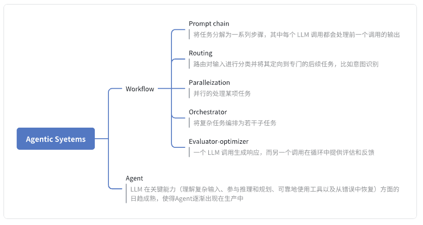
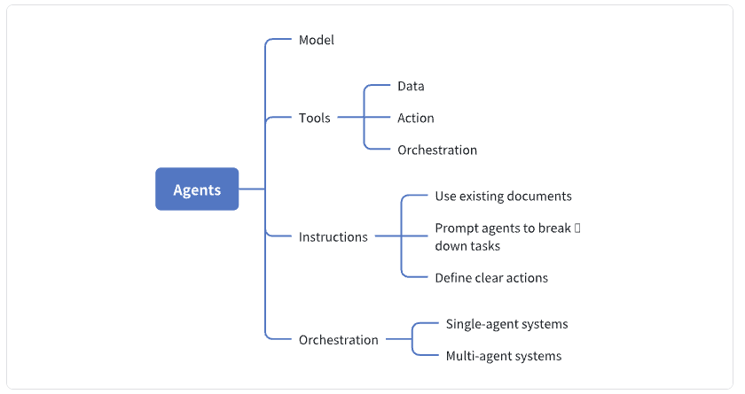
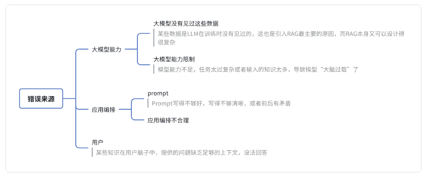
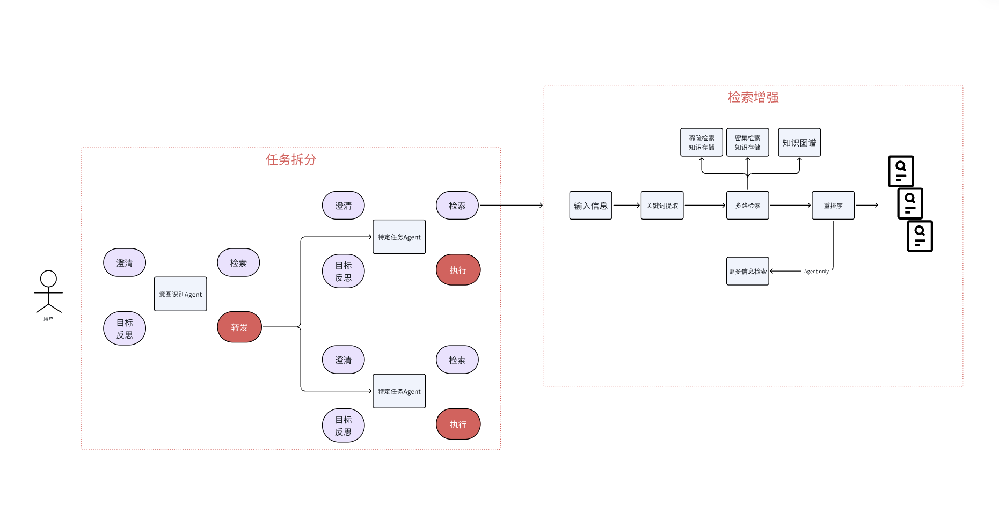
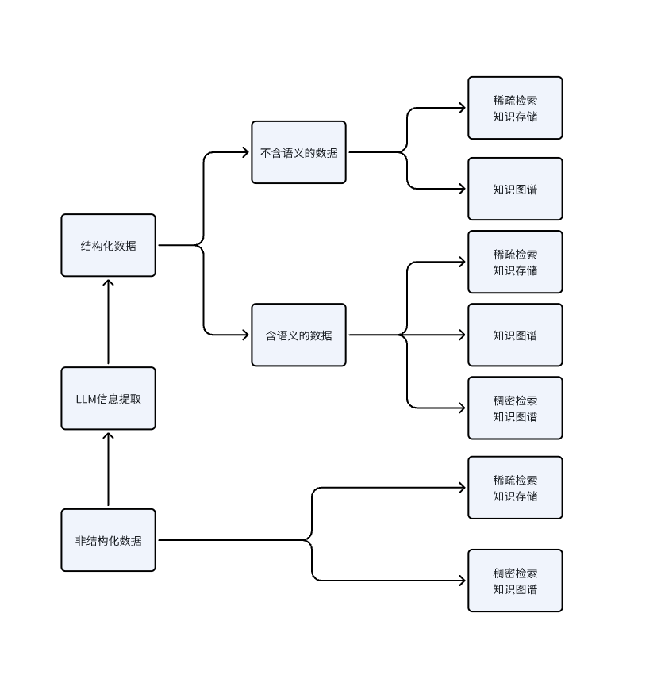
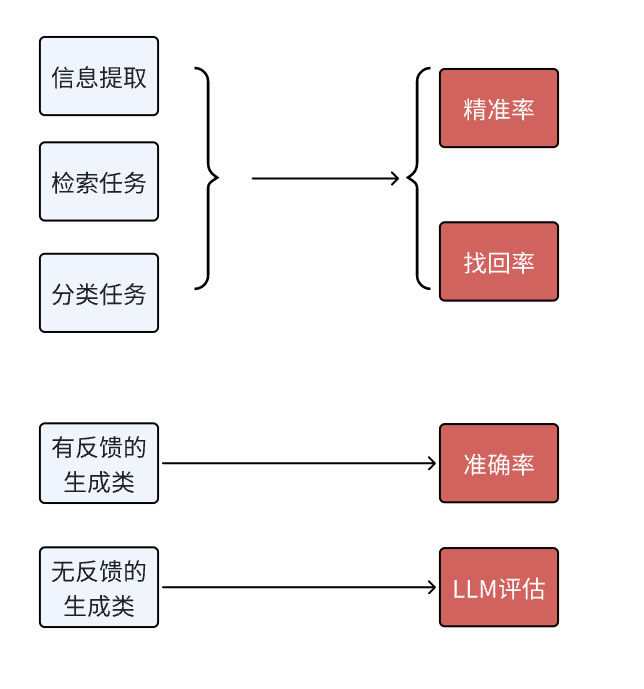

# How to Design Agent Architecture: OpenAI or Anthropic?

## 1. The bitter lesson

In the process of developing applications around large models, people have gradually learned one bitter lesson: process architectures and manual optimizations that take hundreds of person-hours are often reset to zero by the next model version iteration.

In early technical practice from 2023 to 2024, when open source models such as GLM-6B were used, developers commonly ran into the limits of base models. Because context was small and reasoning ability was insufficient, engineers had to add many manual code interventions to keep systems reliable. But as model intelligence grew exponentially, those once-critical adaptation modules were forced out onto the system disconnect. This cycle of constantly rebuilding the technical route has become a bitter lesson in AI engineering: every time a new model iteration arrives, the whole tech stack painfully moves from "re-engineering" to "refactoring by deleting redundancy."

Traditional software architecture was long dominated by the client-server paradigm: the client initiates a data exchange request, the server performs a data operation, and then returns a result after processing it through predefined logic. This linear interaction model laid the foundation for modern systems for decades. Even today, as automation chains and low-code platforms develop quickly, the core system logic still depends heavily on manual code optimization performed by engineers during development. After deployment to production, the system becomes a static precompiled computing process, and the execution path fully follows predefined deterministic rules.

In modern system architecture evolution, a probabilistic computing paradigm is gradually replacing the traditional deterministic paradigm: dynamic realtime inference mechanisms based on deep learning are starting to define how applications are built. Take the OpenAI ecosystem as an example: tens of thousands of intelligent applications around the world integrate its AI inference services through APIs, and each service call includes a complex neural-network decision-making process, not a simple data operation. This fundamental shift means that behavioral decision rights in a software system have moved from a static codebase to a continuously evolving model. Even more revolutionary is that the application system receives an external amplification effect from continuous model evolution: even if local business logic remains unchanged, iterative upgrades to the underlying AI capabilities automatically raise the application's intelligence level.

On the development curve of artificial intelligence, the iteration speed of large models has already moved beyond familiar intuition. Their intelligent decision systems avoid the complexity of traditional workflow architectures and show dynamic adaptability beyond manual intervention. This trajectory reveals a paradigm shift in AI engineering: compared with the linear model of "fine manual control + model execution response" in traditional human-machine cooperation, a dynamic decision system based on an autonomous reasoning engine forms an exponential advantage. When the model keeps expanding its cognitive boundaries, the surrounding system naturally receives internal evolutionary energy from emergent intelligence.

At this technical fork in the road, we face the final test of competing paradigms: should we continue with a static process orchestration system that depends on manual architecture design and confines the Agent inside a predefined frame, or should we follow the exponential growth of autonomous reasoning ability in large models and build a universal intelligent decision architecture that adapts to the environment? This choice is essentially a turning point in judging the evolution path of intelligent systems. When the model's internal intelligence exceeds the boundaries of manual design, dynamically evolving autonomous decision systems will become the dominant paradigm of technical development.

## 2. Anthropic's understanding

On December 19, 2024, Anthropic published the blog `Building effective agents`, announcing its understanding of Agent to the world and quietly opening the curtain on 2025 as the year of intelligent agents.

In this article, Anthropic calls what people usually discuss as Agent `agentic systems` and gives two different architectures: `workflow` and `agent`.

> If you have used low-code devops platforms such as dify, you will notice that these platforms already use this classification in practice.

Workflow is a system that coordinates LLMs and tools through predefined code paths.

Agent is a system where the LLM dynamically directs its own process and tool usage, keeping control over how the task is performed.

Anthropic also provides design patterns for these two types of Agentic systems. If you have been working on large model applications for a long time, the diagram below will be easy to understand.

## 3. OpenAI's understanding

As a senior player in the market, after Anthropic took the initiative from Function Call through MCP, OpenAI wanted to say something about the Agent industry standard. So in April 2025 it published `A practical guide to building agents`.

But because Anthropic's article had already set a strong reference point, OpenAI's publication immediately faced criticism. At the front was Harrison Chase, founder of LangChain, a familiar name to developers. He responded to OpenAI with `How to think about agent frameworks`.

> As an outside observer, I think one possible reason is that Anthropic recommended LangGraph in its blog, while OpenAI mentioned the difference between declarative and non-declarative graphs in its article. This is exactly the point for which LangGraph and LangChain are often criticized, and the text indirectly pointed to LangGraph's shortcomings.

Let's look at OpenAI's key idea.

Continuing Anthropic's definition of Agentic system, OpenAI also thinks an Agent can have workflow state, but excludes one case: applications that integrate LLMs but do not use LLMs to control the workflow are not Agents.

> Original wording: Applications that integrate LLMs but don't use them to control workflow execution, think simple chatbots, single-turn LLMs, or sentiment classifiers, are not agents.
> Personally, I do not think it is necessary to argue too strictly about whether an application is an Agent.

In its article, OpenAI highlights four keywords: `model`, `tool`, `instruction`, and `orchestration`; `orchestration` can also be part of `tool`.

Also, as a large player, OpenAI and other big companies need to care more about safety than smaller companies do. So they set aside a separate chapter for Guardrails.

If you read this article, you will notice that its understanding of Agent is closer to the `agent` in Anthropic's article, rather than the broader `Agentic Systems`.

## 4. One common architecture

I think the two companies emphasize different parts of Agent. But developers do not need to take sides: we can take the strengths of both and melt them into our own design paradigm. Below is a common architecture from Thoughtworks.

### 4.1. Probability of task failure

#### 4.1.1. Common sources of errors

#### 4.1.2. Three capabilities of an LLM application

The three most important capabilities of an LLM application are architecture, knowledge, and model.

**Architecture**

Task decomposition: let the model complete one small task at a time. Why does CoT work? The reason is that the large model has not seen data where a complex task is solved in one step, and it was not pre-trained on such data. But it has seen data where a complex task is broken into small subtasks, and this is what it does well. Task decomposition is basically manual CoT.

Retrieval augmentation: make sure the retrieved knowledge is complete enough and as accurate as possible.

**Knowledge**

Knowledge engineering: build knowledge in several ways, including sparse retrieval based on BM25, dense retrieval based on semantic vectors, and Knowledge Graph. Only hybrid retrieval over several forms of knowledge gives the best result.

**Model**

Use a stronger foundation model whenever possible.

Continue training the model to inject vertical-domain knowledge, and fine-tune for the specific task format.

Optimize the prompt.

### 4.2. Architecture idea for LLM applications

LLM application architecture mainly handles task decomposition and retrieval augmentation.

#### 4.2.1. Architecture diagram

#### 4.2.2. Task decomposition

For task decomposition, several Agents are usually separated.

***At the input side, there is usually an intent recognition Agent***

It clarifies ambiguity or missing information in the user's question.

It obtains relevant information through retrieval to help determine intent.

It routes the specific task to a specific Agent.

***Downstream Agents focus more on the concrete task***

They perform task-level clarification.

They retrieve information related to task execution.

They perform further task decomposition. At this stage, each subtask may simply be a function or tool, and if it becomes complex, it may be another Agent.

### 4.3. Knowledge engineering in an LLM application

Start from the original data structure.

#### 4.3.3. Structured data

For data without semantic information, you can:

build MinHash LSH;

build a Knowledge Graph.

For data with semantic information, you can additionally build a Vector DB.

#### 4.3.4. Unstructured data

Build an inverted index to support methods such as BM25.

Build a Vector DB of semantically similar vectors.

Use an LLM for information extraction, convert it into structured data, then perform knowledge engineering for structured data.

### 4.4. Model optimization in an LLM application

#### 4.4.1. Prompt optimization

The Prompt should be clear, specific, and contain no ambiguity of its own.

Structured Prompt.

For tasks where reasoning gives better performance, use CoT.

When maximum performance is needed, use Self Consistency.

#### 4.4.2. Model fine-tuning

If you need to inject knowledge into the model, you still need CT (`continual training`). SFT (`supervised fine-tuning`) is weak for knowledge injection.

For some small concrete tasks, SFT on a small model works very well. Sometimes even a smaller BERT model can be used.

### 4.5. Iterative optimization process for LLM applications

#### 4.5.1. Evaluation metrics

**For generative tasks with feedback**: mainly Text-to-SQL and Text-to-Code. We can write reference SQL or unit tests to check task accuracy.

**For generative tasks without feedback**: we need to use a large model for evaluation. Some people may say it is bad when the large model is both athlete and referee. But first, we can improve the model's evaluation ability through fine-tuning; second, changing the Prompt also changes the direction of the model's capabilities, so this method is still applicable. Of course, there are limits too. In that case, fine-tuning can be tried (see 4.2).

#### 4.5.2. Experiment records

As in traditional machine learning and deep learning, an LLM application should record every experiment run. MLOps frameworks such as MLflow are good tools: they help record Prompt, Temperature, Top P, and other parameters, as well as experiment results.

## References

[1] [OpenAI "Agent bible" overturned? LangChain founder fires back: "full of pitfalls"!](https://mp.weixin.qq.com/s/ME29kbyLXotc3s22zwBPkA)

[2] [A practical guide to building agents](https://cdn.openai.com/business-guides-and-resources/a-practical-guide-to-building-agents.pdf)

[3] [How to think about agent frameworks](https://blog.langchain.dev/how-to-think-about-agent-frameworks/)

[4] [Building effective agents](https://www.anthropic.com/engineering/building-effective-agents?ref=blog.langchain.dev)

[5] [LLM应用落地实施手册](https://mp.weixin.qq.com/s/t-uYwd9NOxJIAIMAYWEqhg)
